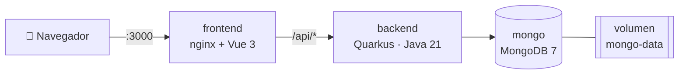

# 📚 StudyTracker

Una app web para **planificar, cronometrar y medir tu tiempo de estudio**. Registra tus materias, arma un plan semanal, estudia con un timer (libre o Pomodoro), ponte metas y desbloquea logros mientras avanzas.

Todo corre en Docker: **solo necesitas Docker instalado** para tenerlo funcionando en tu máquina.


---

## ✨ Funcionalidades

| | Función | Descripción |
|---|---|---|
| 📘 | **Materias** | Crea lo que estudias con un color y una meta de horas por semana. Puedes archivarlas sin perder el historial. |
| 🗓️ | **Plan semanal** | Arma tu semana de lunes a domingo: qué materia, a qué hora y cuántos minutos. |
| ⏱️ | **Timer** | Modo **libre** (cronómetro) o **Pomodoro** (enfoque, descanso y descanso largo configurables) con aviso sonoro y notificaciones del navegador. El timer vive en el servidor, así que **no se pierde si cierras la pestaña**. |
| 📝 | **Notas por sesión** | Al terminar, anota qué estudiaste y califica tu concentración del 1 al 5. |
| 📊 | **Dashboard** | Lo estudiado hoy y en la semana frente a tu plan, gráfica de los últimos 7 días, reparto por materia y avance de cada meta semanal. |
| 🔥 | **Rachas y mapa de calor** | Días seguidos estudiando y un calendario anual de actividad al estilo de GitHub. |
| 🎯 | **Metas** | Metas de horas semanales, mensuales o con fecha límite, para una materia o para todas. |
| 🏆 | **Logros** | 12 logros que se desbloquean solos: primera sesión, 10, 50 y 100 horas, rachas de 3, 7 y 30 días, maratón de 2 horas, madrugador, búho nocturno… |
| 🕘 | **Historial** | Todas tus sesiones filtradas por fecha y materia; puedes editarlas, borrarlas o registrar a mano una que no cronometraste. |
| 🌙 | **Tema claro / oscuro** | Sigue la preferencia de tu sistema y puedes cambiarlo con un clic. Funciona también en el celular. |

---

## 🚀 Inicio rápido

### Requisitos

- [Docker Desktop](https://www.docker.com/products/docker-desktop/) (Windows / macOS) o Docker Engine + Docker Compose (Linux).

No hace falta tener Java, Maven ni Node: todo se compila dentro de Docker.

### Pasos

```bash
# 1. Clona el repositorio
git clone https://github.com/ElvisGarcia009/StudyTracker.git
cd StudyTracker

# 2. (Opcional) Crea tu archivo de configuración
cp .env.example .env

# 3. Levanta todo
docker compose up -d --build
```

La primera vez tarda unos minutos porque descarga las imágenes y compila el proyecto. Cuando termine, abre:

| Qué | URL |
|---|---|
| 📚 **StudyTracker** | **http://localhost:3000** |
| 📖 Documentación de la API (Swagger) | http://localhost:8081/q/swagger-ui |
| ❤️ Estado del backend | http://localhost:8081/q/health |

### Comandos útiles

```bash
docker compose ps              # ver el estado de los contenedores
docker compose logs -f backend # ver los logs del backend
docker compose stop            # detener (los datos se conservan)
docker compose start           # volver a arrancar
docker compose down            # borrar los contenedores (los datos se conservan en el volumen)
docker compose down -v         # ⚠️ borrar contenedores Y todos los datos
```

Después de un `git pull` con cambios, vuelve a ejecutar `docker compose up -d --build`.

---

## ⚙️ Configuración

Todas las variables tienen un valor por defecto, así que el `.env` es opcional.

| Variable | Por defecto | Para qué sirve |
|---|---|---|
| `APP_PORT` | `3000` | Puerto de la app en el navegador. |
| `API_PORT` | `8081` | Puerto del backend (Swagger). |
| `MONGO_USER` / `MONGO_PASSWORD` | `studytracker` | Credenciales de MongoDB. **Solo se aplican la primera vez** que se crea el volumen de datos. |
| `MONGO_DATABASE` | `studytracker` | Nombre de la base de datos. |
| `MONGO_PORT` | `27018` | Puerto de Mongo en tu máquina (solo `127.0.0.1`), por si quieres conectarte con MongoDB Compass. Usa 27018 para no chocar con un Mongo local. |
| `TZ` | `America/Santo_Domingo` | Tu zona horaria. Define qué es "hoy" para las rachas, el dashboard y el mapa de calor. [Lista de zonas](https://en.wikipedia.org/wiki/List_of_tz_database_time_zones). |

> 💡 **Importante:** ajusta `TZ` a tu zona horaria (por ejemplo `America/Mexico_City`, `America/Bogota`, `Europe/Madrid`) para que los días se cuenten bien.

---

## 🏗️ Arquitectura



- **frontend:** Vue 3 + Vite, compilado y servido por nginx. nginx también redirige `/api/*` al backend, así que todo comparte el mismo origen y no hace falta CORS.
- **backend:** Quarkus 3 (REST + Jackson, MongoDB Panache, Hibernate Validator, OpenAPI y Health).
- **mongo:** MongoDB 7. Los datos se guardan en el volumen `mongo-data` y sobreviven a reinicios.

### Estructura del proyecto

```
StudyTracker/
├── docker-compose.yml
├── .env.example
├── backend/                          # API en Quarkus
│   ├── Dockerfile
│   └── src/main/java/com/studytracker/
│       ├── entity/        # Documentos de MongoDB (Subject, StudySession, Goal…)
│       ├── repository/    # Repositorios Panache
│       ├── service/       # Lógica de negocio (timer, estadísticas, rachas, metas)
│       ├── achievement/   # Catálogo de logros y su evaluador
│       ├── resource/      # Endpoints REST (/api/...)
│       ├── dto/           # Objetos de entrada y salida
│       └── exception/     # Errores en JSON
└── frontend/                         # Interfaz en Vue 3
    ├── Dockerfile
    ├── nginx.conf
    └── src/
        ├── views/         # Una vista por pantalla (Dashboard, Timer, …)
        ├── components/    # Piezas reutilizables (HeatMap, BaseModal, StatCard…)
        ├── stores/        # Estado global con Pinia (materias, timer, avisos)
        ├── api/           # Llamadas HTTP al backend
        └── utils/         # Formatos, sonidos y gráficas
```

---

## 🧑‍💻 Desarrollo local (sin Docker para la app)

Útil si quieres modificar el código y ver los cambios al instante.

**Requisitos:** Java 21 y Node 20.19 o superior. Maven no hace falta: el proyecto trae `mvnw`.

```bash
# 1. Levanta solo MongoDB
docker compose up -d mongo

# 2. Backend con recarga en caliente → http://localhost:8080
cd backend
./mvnw quarkus:dev        # en Windows: mvnw.cmd quarkus:dev

# 3. En otra terminal, el frontend → http://localhost:5173
cd frontend
npm install
npm run dev
```

Vite redirige `/api` a `http://localhost:8080`. Si tu backend corre en otro puerto, define `VITE_API_TARGET` antes de `npm run dev`.

### Tests

```bash
cd backend
./mvnw test
```

Los tests también se ejecutan durante `docker compose build`: si alguno falla, la imagen no se construye.

---

## 🔌 API

Todos los endpoints están bajo `/api`. La documentación interactiva completa está en **Swagger**: http://localhost:8081/q/swagger-ui

| Recurso | Endpoints |
|---|---|
| Materias | `GET/POST /api/subjects` · `PUT/DELETE /api/subjects/{id}` |
| Plan semanal | `GET/POST /api/schedule` · `PUT/DELETE /api/schedule/{id}` |
| Timer | `GET /api/sessions/active` · `POST /api/sessions/start` · `POST /api/sessions/{id}/pause` · `/resume` · `/pomodoro` · `/stop` |
| Historial | `GET /api/sessions?from=2026-01-01&to=2026-01-31&subjectId=…` · `POST /api/sessions` (manual) · `PUT/DELETE /api/sessions/{id}` |
| Metas | `GET/POST /api/goals` · `PUT/DELETE /api/goals/{id}` |
| Logros | `GET /api/achievements` |
| Estadísticas | `GET /api/stats/dashboard` · `GET /api/stats/heatmap?days=365` |

Ejemplo:

```bash
curl -X POST http://localhost:3000/api/subjects \
  -H "Content-Type: application/json" \
  -d '{"name":"Inglés","weeklyGoalMinutes":300}'
```

Los errores siempre tienen el mismo formato:

```json
{ "status": 400, "message": "El nombre es obligatorio", "errors": [{ "field": "name", "message": "El nombre es obligatorio" }] }
```

---

## 💾 Respaldo y restauración

```bash
# Crear un respaldo en ./backup.archive
docker exec studytracker-mongo mongodump -u studytracker -p studytracker --authenticationDatabase admin --db studytracker --archive > backup.archive

# Restaurarlo (reemplaza los datos actuales)
docker exec -i studytracker-mongo mongorestore -u studytracker -p studytracker --authenticationDatabase admin --drop --archive < backup.archive
```

Si cambiaste las credenciales en `.env`, usa las tuyas.

---

## 🛠️ Solución de problemas

| Problema | Solución |
|---|---|
| `port is already allocated` | Otro programa usa ese puerto. Cambia `APP_PORT`, `API_PORT` o `MONGO_PORT` en `.env` y vuelve a ejecutar `docker compose up -d`. |
| La página carga pero dice "No se pudo conectar con el servidor" | El backend todavía está arrancando o falló. Revisa `docker compose ps` y `docker compose logs backend`. |
| Los días o las rachas no cuadran con mi hora | Ajusta `TZ` en `.env` a tu zona horaria y ejecuta `docker compose up -d`. |
| Cambié `MONGO_PASSWORD` y el backend no conecta | Las credenciales solo se aplican al crear el volumen. Vuelve a la contraseña anterior, o borra los datos con `docker compose down -v` y levanta de nuevo. |
| No suena ni llega la notificación del Pomodoro | Pulsa "🔔 Activar notificaciones" en el Timer y permite las notificaciones del sitio. Algunos navegadores bloquean el sonido si no has interactuado con la página. |

---

## 🗺️ Ideas para el futuro

- [ ] Exportar e importar datos en CSV o JSON.
- [ ] Recordatorios a la hora de cada bloque del plan.
- [ ] Instalar la app en el celular (PWA).
- [ ] Temas o etiquetas dentro de cada materia (por ejemplo "Java → Streams").
- [ ] Multiusuario con inicio de sesión (JWT).

¿Se te ocurre algo más? ¡Abre un *issue* o un *pull request*!

---

## 🤝 Contribuir

1. Haz un fork del repositorio.
2. Crea una rama: `git checkout -b feature/mi-mejora`.
3. Haz tus cambios y verifica que `./mvnw test` y `npm run build` pasen.
4. Abre un pull request explicando qué cambiaste.

## 📄 Licencia

Distribuido bajo la licencia [MIT](LICENSE). Úsalo, modifícalo y compártelo libremente.
